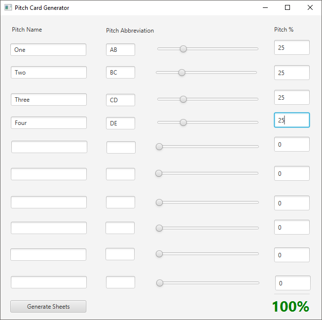
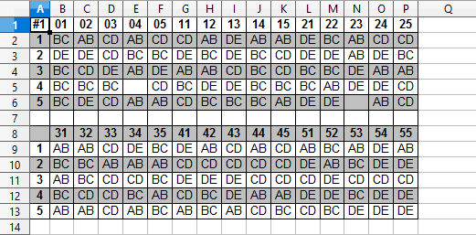
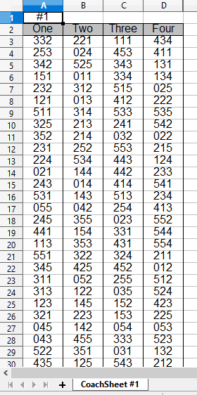

# Pitch Card Generator
This is an application that generates random baseball/softball pitch calling cards.
- The user enters up to ten pitches (name, abbreviation, and percentage).
- Those pitches are randomly sorted into a printable grid that fits on the player's wrist.
- A matching coach sheet is generated.
- Multiple sheets can be created from the same data.

Download the [application](https://github.com/johnjago/pitch-card-generator/releases/download/v1.0/PitchCardGenerator.jar) (all operating systems).

